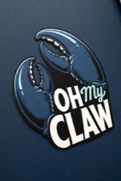

<p align="center">
  
</p>

<h1 align="center">Oh My Claw</h1>

<p align="center">
  A local-first agent gateway for WhatsApp, Telegram, iMessage, Signal, terminal chat, tools, memory, scheduling, and a private dashboard.
</p>

## What It Is

Oh My Claw connects everyday messaging channels to one shared agent runtime. Instead of building a separate bot for every app, the gateway normalizes messages, queues work, runs the selected AI provider, and exposes the same tool surface everywhere.

The project currently ships as a Node.js gateway in `gateway/` with:

- WhatsApp, Telegram, iMessage, Signal, and terminal entry points.
- Claude, OpenAI, and Opencode provider support.
- Gateway tools for sending messages, images, and documents.
- OpenAI image generation through `mcp__gateway__generate_image`.
- Composio integrations for external app actions.
- File-backed memory, session history, scheduled tasks, uploads, and transcripts.
- A Next.js dashboard for sessions, integrations, memory, scheduling, and config.

## Quick Start

```bash
cd gateway
npm install
cp .env.example .env
npm run cli
```

Useful commands:

```bash
npm run chat     # terminal chat
npm start        # start the messaging gateway
npm run setup    # adapter setup wizard
npm run cli      # interactive menu
```

Dashboard:

```bash
cd gateway/ui
npm install
cp .env.example .env.local
npm run dev
```

## Provider Config

Set the active provider in `gateway/.env`:

```bash
OH_MY_CLAW_PROVIDER=claude
```

Valid values:

```bash
OH_MY_CLAW_PROVIDER=claude
OH_MY_CLAW_PROVIDER=openai
OH_MY_CLAW_PROVIDER=opencode
```

Default model settings:

```bash
CLAUDE_MODEL=opus-4.8
OPENAI_MODEL=gpt-5.5
OPENAI_IMAGE_MODEL=gpt-image-1.5
```

Required keys depend on the provider and tools you enable:

```bash
ANTHROPIC_API_KEY=
OPENAI_API_KEY=
COMPOSIO_API_KEY=
TELEGRAM_BOT_TOKEN=
```

See [gateway/.env.example](gateway/.env.example) and [gateway/ui/.env.example](gateway/ui/.env.example) for the full local configuration surface.

## Channels

| Channel | File | Notes |
| --- | --- | --- |
| Terminal | `gateway/cli.js` | Best local test surface |
| WhatsApp | `gateway/adapters/whatsapp.js` | Uses Baileys QR authentication |
| Telegram | `gateway/adapters/telegram.js` | Uses a BotFather token and allowlists |
| iMessage | `gateway/adapters/imessage.js` | macOS only |
| Signal | `gateway/adapters/signal.js` | Requires `signal-cli` |
| Dashboard | `gateway/ui` | Next.js app that proxies gateway APIs |

## Tooling

Built-in tool groups include:

- Gateway messaging: send text, images, and documents back to the active chat.
- Image generation: create OpenAI-generated images and send them through supported channels.
- Scheduling: delayed, recurring, and cron-like tasks.
- Composio: external app actions and connected account workflows.
- AppleScript: local macOS automation.
- Uploads: sanitized file handling with retention limits.
- Memory: local file-backed short and long-term context.

## Repository Map

```text
.
+-- README.md
+-- assets/
|   +-- oh-my-claw-logo.jpg
+-- gateway/
    +-- config.js
    +-- gateway.js
    +-- cli.js
    +-- adapters/
    +-- agent/
    +-- commands/
    +-- memory/
    +-- providers/
    +-- sessions/
    +-- tools/
    +-- ui/
    +-- skills-main/
```

## Safety Notes

- Do not commit real `.env` files, auth folders, transcripts, uploads, memory files, or local MCP configs.
- Use channel allowlists before connecting messaging accounts broadly.
- Treat `COMPOSIO_API_KEY`, provider keys, and messaging credentials as local secrets.
- The gateway is local-first. Production hardening should add stronger auth, audit, approval gates, and deployment controls before broad use.

## License

MIT. See [gateway/LICENSE.md](gateway/LICENSE.md).
