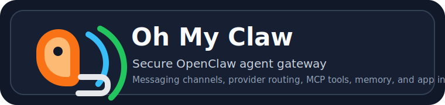

<p align="center">
  
</p>

<p align="center">
  <a href="LICENSE.md"></a>
  
  
  
  
</p>

# Oh My Claw Gateway

This package is the runnable Node.js gateway for Oh My Claw. It hosts the
messaging adapters, agent runner, providers, file-backed memory, MCP-style
tools, scheduling, uploads, Composio integrations, HTTP API, Docker setup, and
the Next.js dashboard under `ui/`.

The package identity is `oh-my-claw`. Use the `oh-my-claw` CLI command and
`OH_MY_CLAW_WORKSPACE` only when you need to override the default memory
workspace.

This is not yet the final cognitive-agent runtime. It does not contain the
Phase 2 `IncomingTurn -> runTurn -> dispatchTool -> approval -> memory -> audit`
architecture. Treat this as the current gateway implementation and the place to
harden or migrate from.

## Install

```bash
npm install
touch .env
npm run cli
```

Useful commands:

```bash
npm run chat              # terminal chat
npm start                 # start messaging gateway
npm run setup             # adapter setup wizard
npm run cli               # interactive menu
npm run skills:manifest   # rebuild skills-main/MANIFEST.json
```

## Runtime Shape

```text
adapter / CLI / dashboard HTTP endpoint
        |
        v
gateway queue
        |
        v
agent/runner.js
        |
        +--> providers/
        +--> agent/mcp-bridge.js
        +--> memory/manager.js
        +--> sessions/manager.js
        +--> tools/
```

Primary files:

| File | Purpose |
| --- | --- |
| `gateway.js` | Starts adapters, HTTP API, Composio session, cron execution, and SSE events |
| `cli.js` | Interactive CLI and terminal chat entry point |
| `config.js` | Channel, provider, workspace, and tool configuration |
| `agent/runner.js` | Per-session queue and run coordinator |
| `agent/claude-agent.js` | Shared agent orchestration, prompt, memory, cron, gateway tools |
| `agent/mcp-bridge.js` | Tool bridge for non-Claude providers and built-in tools |
| `providers/` | Claude, Opencode, and OpenAI provider implementations |
| `memory/manager.js` | File-backed memory management |
| `sessions/manager.js` | Session and transcript state |
| `tools/` | Gateway, cron, AppleScript, upload, PDF, and formatting helpers |
| `ui/` | Next.js dashboard package |

## Configuration

Configuration lives in `config.js` and environment variables. The default
workspace is this package directory unless `WORKSPACE_DIR` is set.

Common gateway variables:

| Variable | Description |
| --- | --- |
| `ANTHROPIC_API_KEY` | Claude provider API key |
| `COMPOSIO_API_KEY` | Composio tool router API key |
| `OPENAI_API_KEY` | OpenAI provider and transcription helper key |
| `OPENAI_BASE_URL` | Optional OpenAI-compatible endpoint |
| `OPENAI_MODEL` | Optional OpenAI model override |
| `PORT` | Gateway HTTP port. Defaults to `4096` |
| `WORKSPACE_DIR` | Override package workspace directory |
| `OH_MY_CLAW_WORKSPACE` | Direct workspace override for memory manager callers |
| `TELEGRAM_BOT_TOKEN` | Telegram bot token |
| `SIGNAL_PHONE_NUMBER` | Signal phone number |

Channel allowlists:

| Variable | Description |
| --- | --- |
| `WHATSAPP_ALLOWED_DMS` | Comma-separated DM allowlist, or `*` |
| `WHATSAPP_ALLOWED_GROUPS` | Comma-separated group allowlist, or `*` |
| `TELEGRAM_ALLOWED_DMS` | Comma-separated user allowlist, or `*` |
| `TELEGRAM_ALLOWED_GROUPS` | Comma-separated group allowlist, or `*` |
| `TELEGRAM_GUEST_DMS` | Telegram users with guest-only tool permissions |
| `IMESSAGE_ALLOWED_DMS` | iMessage DM allowlist |
| `IMESSAGE_ALLOWED_GROUPS` | iMessage group allowlist |
| `SIGNAL_ALLOWED_DMS` | Signal DM allowlist |
| `SIGNAL_ALLOWED_GROUPS` | Signal group allowlist |

## Providers

Provider registration is in `providers/index.js`.

| Provider | Config value | Notes |
| --- | --- | --- |
| Claude Agent SDK | `claude` | Default provider |
| Opencode | `opencode` | Uses `agent.opencode` host, port, and model |
| OpenAI | `openai` | Uses Chat Completions and `agent/mcp-bridge.js` |

Set the provider in `config.js`:

```js
agent: {
  provider: 'claude',
  maxTurns: 100,
  opencode: {
    model: 'opencode/gpt-5-nano',
    hostname: '127.0.0.1',
    port: 4097
  }
}
```

## Channels

| Channel | File | Requirement |
| --- | --- | --- |
| Terminal | `cli.js` | None beyond provider config |
| WhatsApp | `adapters/whatsapp.js` | Baileys QR login |
| Telegram | `adapters/telegram.js` | Bot token |
| Signal | `adapters/signal.js` | `signal-cli` |
| iMessage | `adapters/imessage.js` | macOS, Messages.app, `imsg` |

Messages from users outside configured allowlists are dropped by the adapters.

## HTTP API

The gateway HTTP server starts on `PORT` or `4096`.

| Endpoint | Purpose |
| --- | --- |
| `GET /` | Status JSON |
| `GET /qr` | WhatsApp QR page |
| `GET /sessions` | List sessions |
| `GET /sessions/:key` | Session detail and transcript |
| `POST /message` | Send a dashboard-originated message |
| `GET /memory/long-term` | Read long-term memory |
| `GET /memory/daily` | List daily memory files |
| `GET /memory/daily/:date` | Read one daily memory file |
| `GET /memory/search?q=...` | Search memory files |
| `POST /memory/update` | Update long-term or daily memory |
| `GET /integrations` | List connected Composio accounts |
| `GET /integrations/available` | List available Composio toolkits |
| `GET /integrations/connect/:appName` | Start Composio connection flow |
| `GET /config` | Read current in-memory config |
| `POST /config/update` | Mutate current in-memory config |
| `GET /scheduling/jobs` | List cron scheduler jobs |
| `GET /stats` | Dashboard stats |
| `GET /events` | Server-sent gateway events |

`POST /config/update` mutates process memory only. It does not persist changes
to `config.js` or restart adapters.

## Dashboard

The dashboard is a separate Next.js package in `ui/`.

```bash
cd ui
npm install
cp .env.example .env.local
npm run dev
```

Set `GATEWAY_URL` to the gateway URL, usually `http://localhost:4096`.

## Docker

```bash
docker compose up -d --build
docker compose logs -f
```

Docker Compose:

- Reads `.env`.
- Exposes gateway port `4096`.
- Persists WhatsApp auth in the `wa-auth` volume.
- Persists memory in the `memory` volume.

## Local-Only Files

Do not commit:

- `.env`
- `composio-toolkits.json`
- `mcp-servers.json`
- `auth_whatsapp/`
- `transcripts/*.jsonl`
- `uploads/`
- `MEMORY.md`
- `memory/*.md`
- `.curated/`, `.system/`, and private skill workspaces

## Next Milestone

The technically correct next milestone is not more adapters or more provider
surface. It is a complete Phase 2 vertical slice with a framework-light core,
Zod input validation, persisted approvals, audit events, memory duplicate and
conflict handling, dashboard approval controls, and tests proving that no tool
can execute outside `dispatchTool`.
